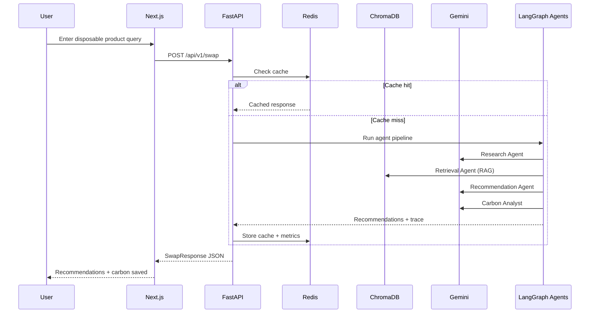
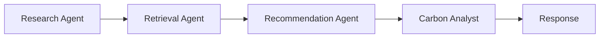

# EcoSwap Architecture

## Request flow (sync)



## Agent graph



## Data stores

| Store | Data | Purpose |
|-------|------|---------|
| ChromaDB | Product embeddings | Semantic search (RAG) |
| Redis DB 0 | Cache + metrics | Performance + analytics |
| Redis DB 1 | Celery broker | Task queue |
| Redis DB 2 | Celery results | Async job results |
| In-memory catalog | Product JSON | Source of truth for IDs |

## Deployment topology (Render)

```
                    ┌─────────────┐
                    │  Next.js    │  (Vercel or Render static)
                    │  Frontend   │
                    └──────┬──────┘
                           │ HTTPS
                    ┌──────▼──────┐
                    │  FastAPI    │  Render Web Service
                    │  (Docker)   │
                    └──────┬──────┘
              ┌────────────┼────────────┐
              │            │            │
       ┌──────▼──────┐ ┌───▼───┐ ┌─────▼─────┐
       │ Celery      │ │ Redis │ │ ChromaDB  │
       │ Worker      │ │       │ │ (volume)  │
       └─────────────┘ └───────┘ └───────────┘
```
